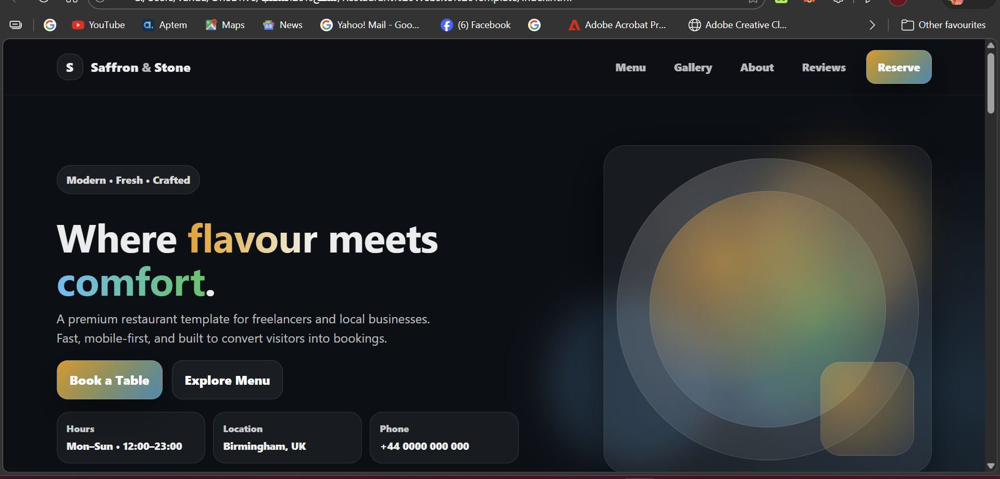

---

## 📸 Preview

  

---
---

## 🎯 Purpose

This project demonstrates:

- UI/UX fundamentals
- Clean and structured code
- Real-world restaurant layout
- Interactive JavaScript components
- Client-ready freelance delivery

---

## 📌 Customization Notes

- Edit menu items inside `script.js` under the `MENU` object.
- Replace gallery placeholders with real images if needed.
- Connect reservation form to WhatsApp, Email API, or booking system.

---

## 🚀 Deployment

Deployed using **GitHub Pages**.

To deploy:
1. Upload files to the repository root.
2. Go to Settings → Pages.
3. Select `main` branch and `/root`.
4. Save.

---

## 👨‍💻 Author

Built by **Dan (fredeeex)**  

Available for custom website development and freelance projects.
